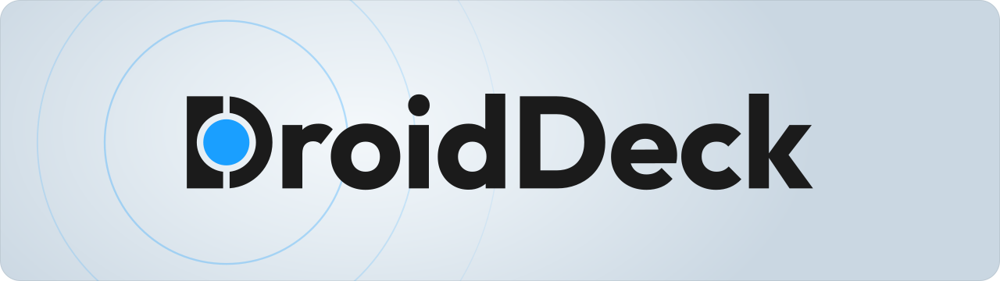

<p align="center"></p>

[English](README.md) | 简体中文

DroidDeck 将 SteamOS 的体验带到 Android：在搭载 Adreno GPU 的掌机上使用 Valve 的 Steam 大屏幕模式，并通过 ARM64 Proton 运行 Windows 游戏。

本仓库是 [Droid-Deck/DroidDeck](https://github.com/Droid-Deck/DroidDeck) 的中文适配 fork。`main` 用于同步上游，`zh-CN` 保存中文补充改动。上游已在提交 `33f7213` 中加入简体中文资源；本分支进一步补齐文件管理器、手柄编辑器、无线调试通知和部分操作提示。

## 安装与中文界面

需要 Android 9 或更新系统，以及受支持的 Adreno GPU（730 或更新型号，或 8xx 系列）。Mali、Xclipse、PowerVR 和 Adreno 710 不受支持。无需 root。运行环境约需 3 GB，桌面和模拟器另需约 1.1 GB。

1. 从[上游 Releases](https://github.com/Droid-Deck/DroidDeck/releases)下载 APK；本 fork 的新增翻译需要使用 `zh-CN` 分支构建的 APK。旧版发布包可能尚未包含上游刚加入的中文资源。
2. 本 fork 的 `zh-CN` 分支默认使用简体中文，无需更改系统语言，也无需寻找应用内语言选项。主界面、文件选择器、会话界面和后台通知均使用中文资源。
3. 安装 Linux 运行环境，点击“开始”并登录。首次启动会下载 Steam。
4. 如需桌面和模拟器，安装“桌面与应用”。商店通过 Flatpak 安装 Flathub 的 ARM64 Linux 应用和游戏，也提供 AppImage 和脚本安装选项。

启动 Steam 前，需关闭开发者选项中的“限制子进程”。Android 12/13 部分设备未显示此选项，可使用首次启动时的自动修复功能，按提示完成无线调试配对。

应用界面语言与 Steam、Linux 桌面、游戏的语言分别管理。Steam 的语言请在 Steam 设置中调整；游戏是否支持中文取决于游戏自身。本分支保留软件名称、文件路径、环境变量和技术标识，不修改这些标识的含义。

> DroidDeck 没有独立官方网站。请勿从冒充项目团队的网站下载文件。

## 构建

上游构建脚本需要 Linux 环境（Windows 可使用 WSL2）、Docker、Java 17、Android SDK/NDK 和 `zstd`。请运行：

```sh
tools/build_local.sh
```

APK 位于 `app/build/outputs/apk/release/app-release.apk`。可设置 `DROIDDECK_PA13_SOURCE_DIR` 指向已有的 PulseAudio 13.0 源码以跳过下载。使用 `tools/deploy_local.sh` 安装到连接的设备。

## 同步与维护

见[中文维护说明](docs/zh-CN-maintenance.md)。新增补充字符串单独放在 `strings_localization.xml`，尽量减少与上游 `strings.xml` 的冲突。

## 社区、限制与许可

上游 [Discord](https://discord.gg/JRGAvawjsm) 提供帮助、预览版和设备反馈。报告问题时附上 `Download/DroidDeck/` 中对应会话文件夹的日志。

兼容性和性能因设备而异，硬件验证有限。桌面合成采用软件渲染，proot 环境中 Firefox 的沙箱保护有所降低。

使用 [GPL-3.0](LICENSE) 许可。运行环境、兼容层、输入和手柄支持基于 WinNative 与 Bannerlator（maxjivi05）。LSFG 基于 Camille LaVey 和 [Eden](https://eden-emu.dev) 项目的工作及 [lsfg-vk](https://github.com/PancakeTAS/lsfg-vk)，由 [maxjivi05](https://github.com/maxjivi05) 移植到 WinNative 与 DroidDeck；需要用户自行购买 [Lossless Scaling](https://store.steampowered.com/app/993090/)，不包含其着色器。Steam 与 Proton 属于 Valve，本项目与 Valve 无隶属关系。
